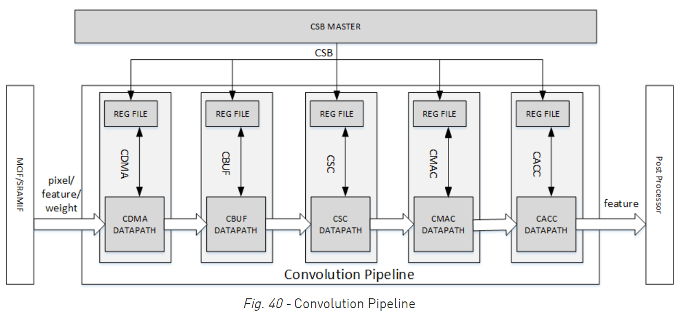
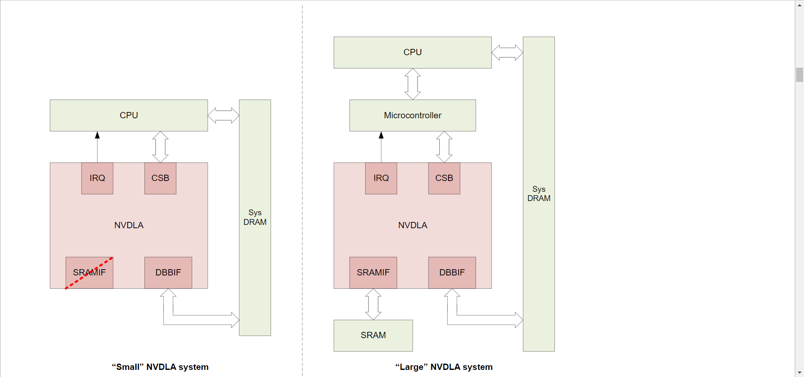
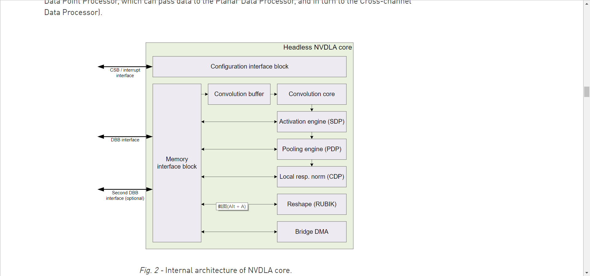
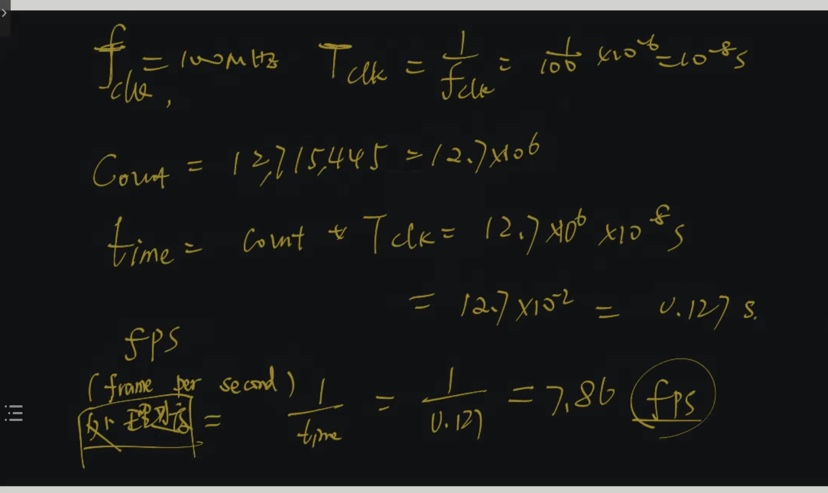

## vivado 初始操作
1. 命令行敲vivado启动
2. flow -> open hardware manager
3. open target -> auto connect
4. 右键 xcvu9p_0(1) -> program device. 下载bitstream.
5. bitstream file 选择xxxx.bit
6. program 

## runtime 代码学习
* main(): setup -> inference_network_batch_num_mach_with_arguments_multi_cores() -> analyse result
* inference_network_batch_num_mach_with_arguments_multi_cores(): setup -> program first op -> loop (for all, enable -> wait for done -> program)
* 不同类型的节点有各自的 all_program_xx_pp(), enable_programmed_xx_pp(), wait_xx_done()
* 为什么wait_for_done那里 op_type的判断与wait_xxx()不是完全对应的? -> 因为比如conv的配置是要把sdp的一块做了, 也正因为conv和sdp一块做了， 所以enable那一块的代码如果遇到节点是conv的, next_op_index是 +2 而不是 +1
* all_program_next_op_pp(): 根据节点的p_op_desc的type调用对应的all_program_xxx_pp() 
* all_program_conv_pp(): 首先设置一些参数, 然后dla_conv_set_producer_mb(), 然后通过 processor_conv_program_mb() 进行真正的配置. 然后对于进行sdp的program
* processor_conv_program_mb(): 首先设置一些要用的参数, 然后等待要用到的模块(图 conv_pipeline))idle, 然后根据参数配置寄存器
* 
* conv相关的函数里对于sdp的操作与sdp相关的函数是一样的, 看不懂为啥不直接调用sdp相关的函数反而再写一遍?
* dla_conv_set_producer_mb(): 配置寄存器
* enable_programmed_conv_pp(): get_processor_consumers() 获取group与rdma的id -> dla_conv_enable_mb(). 对于sdp也进行相同的操作. 先调用的dla_sdp_enable_mb(), 然后再调用dla_conv_enable_mb()
* group和rdma是? -> 只有0和1两个值, 看起来像是 pingpong 的东西. rdma是计算模块用来读取数据的, read dma. group_id代表是计算的pingpong配置的id, rdma代表的是读取数据的pingpong配置的id
* dla_conv_enable_mb(): 配置寄存器使能
* wait_sdp_done(): 读取寄存器状态等待完成
* rubik 和 sgdma? -> rubik的作用见官方文档[unit_description.html#rubik](http://nvdla.org/hw/v1/ias/unit_description.html#rubik), 基本就是reshape, split, merge. 文档中没找到sgdma, 代码里判断如果是sgdma的的op_type, 就走all_program_upsample_pp(), 所以sgdma是和upsample有关的? 不过反正也没有sgdma的节点, 感觉可以先不用纠结这个. upsample相关的可以参考 [知乎-【学习笔记】浅谈Upsampling](https://zhuanlan.zhihu.com/p/359762840) 官方文档上倒是没有找到upsample相关的东西
* kernel_struct_share.h中st_memory_d中各个字段的含义?
* inference_setup 与 inference_arg 与 issue_arg ? 
  * issue_arg 包含 inference_arg 和 op_index. 
  * inference_arg 中有个op_array, 包含所有op操作, 通过op_index可以取出对应index的op, op_index里面每个元素都是op的union, 需要自己用op类型对应的指针去解析. surface_array同理
* kernel_struct.h中三种memory_type的含义? DLA_MEM_MC感觉像ddr? -> 并不是, 这三个代表的是访存接口. 图nvdla_system中, DBBIF代表的是DLA_MEM_MC, SRAMIF代表的是DLA_MEM_CV. DLA_MEM_HW 在图internal_arch_nvdla_core中, 由conv到sdp到pdp的连线是fly mode, 用到的是这个
* nvdla_system: 
* internal_arch_nvdla_core: 
* memory_id是什么? -> dla_gen_global_decl.c中的init_global_var()初始化了全局的memory_d的array, num为11, id为从0到10, 然后通过init_global_var_with_arguments()传给inference_setup. dla_gen_global_decl.c是编译器生成的. 这些memory的数量和大小是怎么划分出来的?
* dla_gen_global_decl.c中还定义了global_tensor_d_array, 大小为2, 应该是分别代表的网络的输入和输出, (之前打印出1024个结果应该就是因为这里输出的size是1024, 但是n*c*h*w只有1000, 不知道为什么, 也许是因为align?)
* memory_data.c中的数据流向: memory_data.c:global_blob_data_x -> dla_gen_global_d_array:global_blob_d_array -> 通过init_gloabl_var_witharguments传给inference_setup.blob_d_array -> inference_arg的p_dep_grap, op_array, sufrace_array -> 在计算模块如conv.c中, 构建对应的数据结构比如dla_conv_surface_desc, 获取array中对应数据的地址, 通过寄存器配置进行program
* conv.c中的processor_conv_program_mb()中, 传进来的input_addr都在0x84xxxxxx, weight_addr基本都在0x82xxxxxx, output_addr都是0, 调用这个函数的地方说output_addr没有用, 所以给了0, 但是这个函数里面明明有把output_addr写入寄存器的代码啊? -> conv结束会进行sdp, 在sdp中配置的输出地址

## 帧率计算方法
